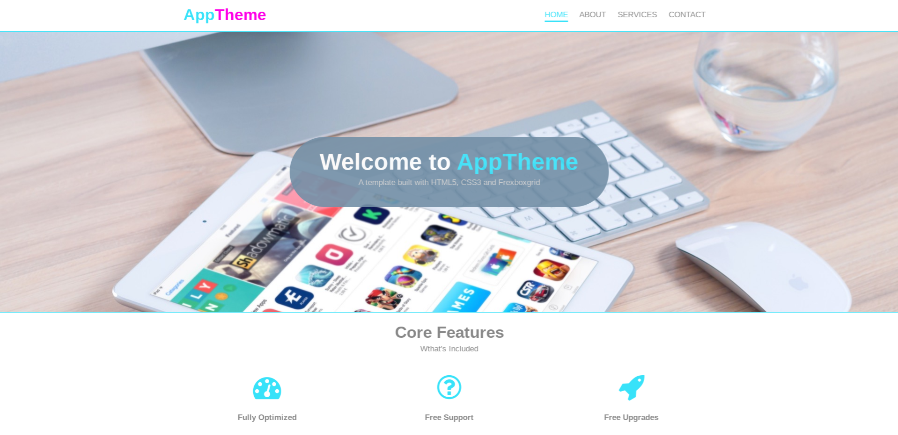

# app-theme

A professional web design Company, created with HTML and CSS.

## Table of contents

## Table of contents

- [General info](#general-info)
- [Technologies](#technologies)
- [Screenshots](#Screenshots)
- [Status](#status)
- [Contributions](#contributions)
- [Launch](https://rago89.github.io/app-theme/.)
- [Licence](#License)

## General info

Making a responsive web design, work with Git and GiyHub, in the second week of incremental development in HYF Belgium program.

## Technologies

Project is created with:

- HTML5
- CSS
  - FLEXBOXGRID

## Screenshots

## Status

Project is: finished, always updating improvements.

## Contributions

All contributions are welcome.

## License

Copyright 2020 HackYourFuture Belgium.
